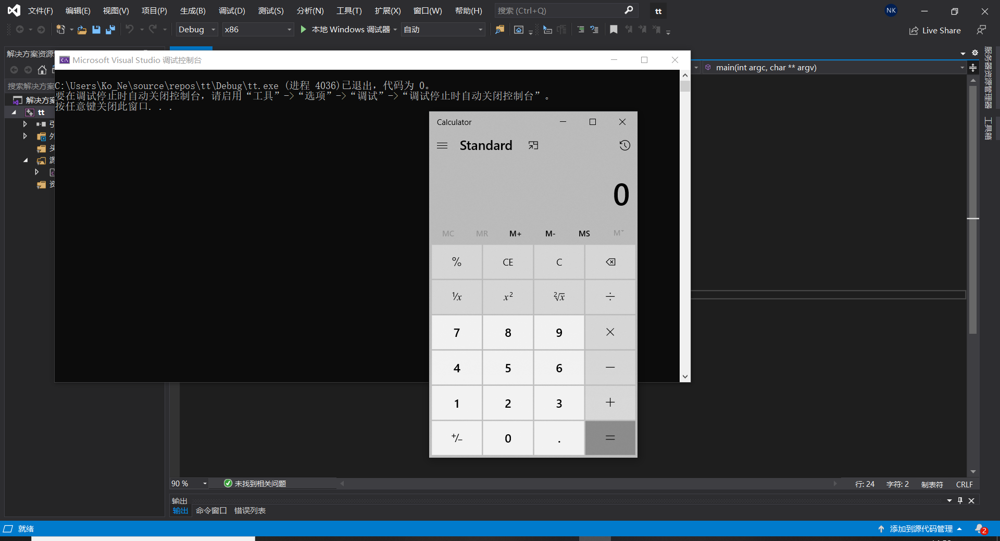

## 实验一 ：shellcode

## 实验要求

- [链接](https://www.exploit-db.com/shellcodes/48116)中的shellcode成功运行
- 能从汇编源码编译通过并成功dump
- 自行查阅资料，搜索Windows PEB结构体，PE文件导入表导出表相关数据结构的文档，解读shellcode原理
- 修改shellcode功能为运行记事本程序notepad.exe
## 实验环境
- win10
- vs2019
- kali
## 实验过程

### 成功运行shellcode

- 将扩展名由.cpp改为.c

- **关闭数据执行保护编译选项


- 运行结果(动图展示)



### 编译通过并dump


### shellcode原理
```bash
想要使用shellcode，我们需要动态获取所需要的系统API地址。
这是因为shellcode的很多操作涉及系统底层，必然会调用windows的API。
正常情况下，windows针对3环用户态程序提供LoadLibrary加载dll，返回dll的基址。
然后通过GetProcAddress从dll种获取函数基址；但这两个函数本身也是windwos 的API，其地址依然需要动态获取。
这时候就用到PEB结构体了。
每个进程都有PEB结构体，记录了进程的各种信息。
比如PEB结构体中的PEB_LDR_DATA结构体，记录了顺序加载的模块链表。
首先找到链表的头指针，遍历链表，查找kernerl32.dll，
kernerl32.dll 基址找到后再根据PE的导出表能找到GetProcAddr的地址，
有了GetProcAddr，又能继续查找LoadLibrary的地址。
有了LoadLibrary和GetProcAddr两大函数地址，任何dll的任何函数入口便都能找到了。
在缓冲区溢出漏洞中，我们把返回地址改成我们自己的函数地址，就可以执行我们自己的程序了。
```

### 修改shellcode弹出记事本

- 核心是将calc.exe修改为notepad.exe，具体修改如下图所示：


- 将修改后的文件传到VirtualBox中的Kali系统中，执行如下命令,得到十六进制代码
```bash
nasm -f win32 win32-WinExec_Calc-Exit.asm -o win32-WinExec_Calc-Exit.o

for i in $(objdump -D win32-WinExec_Calc-Exit.o | grep "^ " | cut -f2); do echo -n '\x'$i; done; echo
```

- 根据的到的16进制代码修改源代码
- 运行结果

