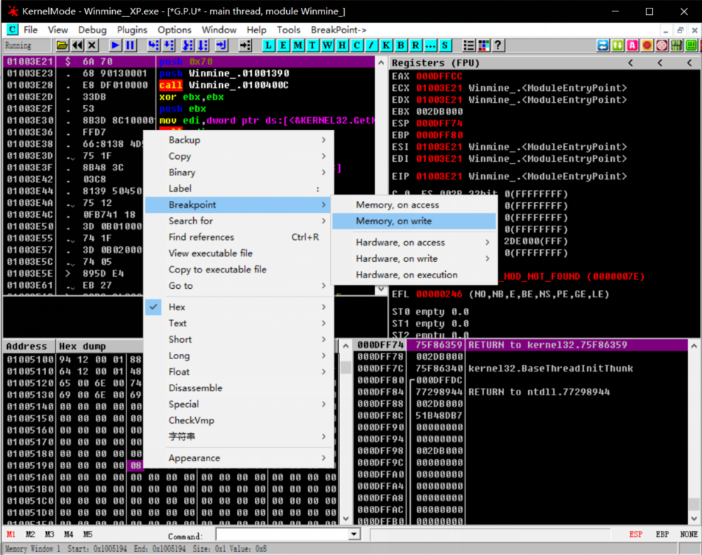

## 简单的扫雷篡改

### 运行环境
- win10
### 使用软件
- cheat engine
- ollydbg
### 实验目的
- 修改扫雷可插旗子数
- 修改时间实现时间停止
### 实验步骤
#### 1.ollydbg载入扫雷  
  
#### 2.CE载入扫雷
- cheat engine是一款十分强大的软件，它可以通过多次搜索找到所需的数据地址。
  
#### 3.定位地址
- 在CE搜索框内输入10（可插旗子数），进行搜索  
- 随后对扫雷进行插旗操作  
  
- 在CE搜索框内输入8（可插旗子数），进行再次搜索  

可以看到CE找到了插旗数量的内存地址为01005194。
#### 4.进行修改
- 在ollydbg中找到01005194所在位置下断点,运行  
 
- 可以看到程序在0100346E处停止了，可推出该条语句是负责减少可插旗子数量的。  
 
- 删除该条语句  
 
操作完成后就可以得到了一个可以放置无限个旗子的扫雷。  
 
#### 5.修改时间
**如法炮制**

- 搜索数据  

- 运行扫雷，使时间增加到8秒，暂停运行,搜索数据  

得到时间的内存地址为0100579c。
- 在ollydbg中找到该内存地址，下断点

- 运行后找到中断语句

- 删除中断语句

至此，一个无限插旗数无限时间的扫雷已经完成。  

#### 6.保存程序
